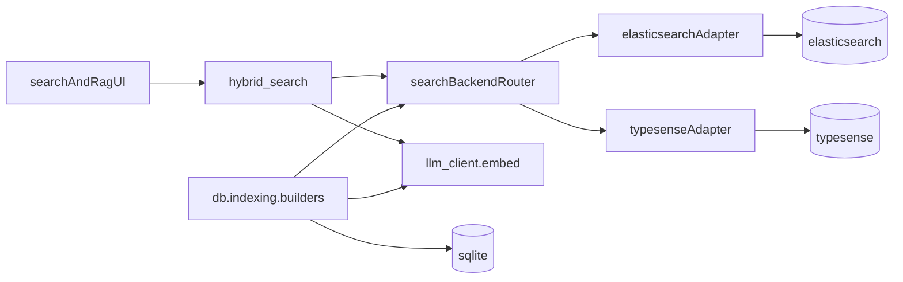

# Add Typesense Support Alongside Elasticsearch

## Context

**Typesense is a search engine**, not an LLM. In this codebase:

- **Elasticsearch** is currently the only retrieval backend.
- **LLM APIs** (embed/chat/vision) remain separate and unchanged.
- Embeddings are generated in Python via `aisearch.llm_client.embed()` and stored as `content_vector` during indexing.

Current tight coupling points:

- [plm-iq/aisearch/es_client.py](plm-iq/aisearch/es_client.py) — connection, mappings, `create_index()`, `get_es()`
- [plm-iq/aisearch/search.py](plm-iq/aisearch/search.py) — `hybrid_search()` runs ES BM25 + kNN + Python RRF
- [plm-iq/db/indexing/base.py](plm-iq/db/indexing/base.py) — `BaseIndexBuilder.build()` calls `get_es()` and `es.index()`
- [plm-iq/db/indexing/build_all.py](plm-iq/db/indexing/build_all.py) — startup health check is ES-only

## Goal (Phase 1)

Support **config-selectable backend**:

- `SEARCH_BACKEND=elasticsearch` (default, current behavior)
- `SEARCH_BACKEND=typesense`

No dual-write or federated merge in phase 1.

## Architecture



### SearchEngine adapter contract

Create a small interface (new module, e.g. `aisearch/search_engine.py`) with normalized methods:

- `health_check() -> None`
- `ensure_collection(name, schema, force=False) -> None`
- `index_document(collection, doc_id, document) -> None`
- `search_bm25(collection, query, size) -> list[SearchHit]`
- `search_vector(collection, query_vector, size) -> list[SearchHit]`
- `search_hybrid(collection, query, query_vector, size) -> list[SearchHit]`

Normalized `SearchHit` shape should match what `search.py` already returns internally (`id`, `score`, `fields`, etc.) so router/RAG code stays stable.

## Planned Changes

### 1) Config and env

Extend [plm-iq/aisearch/config.py](plm-iq/aisearch/config.py):

- `SEARCH_BACKEND` = `elasticsearch` | `typesense` (default: `elasticsearch`)
- Typesense settings:
  - `TYPESENSE_HOST` (default `localhost`)
  - `TYPESENSE_PORT` (default `8108`)
  - `TYPESENSE_PROTOCOL` (default `http`)
  - `TYPESENSE_API_KEY`
- Keep existing ES vars (`ES_HOST`, `ES_USER`, `ES_PASSWORD`)
- Keep embedding vars (`EMBEDDING_MODEL`, `EMBEDDING_DIMENSIONS`, `LLM_*`)

Update `validate()` to warn only for vars required by active backend.

Example `.env` snippet:

```env
SEARCH_BACKEND=typesense
TYPESENSE_HOST=localhost
TYPESENSE_PORT=8108
TYPESENSE_PROTOCOL=http
TYPESENSE_API_KEY=xyz
```

### 2) Elasticsearch adapter (wrap existing code)

Refactor [plm-iq/aisearch/es_client.py](plm-iq/aisearch/es_client.py) behind `ElasticsearchSearchEngine`:

- Preserve current mappings in `BASE_MAPPINGS` / `INDEX_FIELDS`
- Preserve `content` + `content_vector` + entity fields
- Move ES-specific query bodies from [plm-iq/aisearch/search.py](plm-iq/aisearch/search.py) into adapter methods
- Keep Python RRF fusion for ES path (current behavior)

### 3) Typesense adapter (new)

Add `aisearch/typesense_client.py` (or `aisearch/engines/typesense.py`):

- Use official `typesense` Python client (add to [plm-iq/requirements.txt](plm-iq/requirements.txt))
- Map each ES index name to a Typesense collection (`plm_parts`, `plm_bom`, ...)
- Collection schema per entity:
  - `content` as searchable string
  - `content_vector` as `float[]` with `num_dim = EMBEDDING_DIMENSIONS`
  - entity-specific facet/filter fields (`part_number`, `status`, etc.)
- Indexing:
  - upsert docs with stable IDs (same strategy as ES doc IDs)
  - include embedding from `_add_embedding()`
- Query modes:
  - BM25 mode: keyword `q` against `content` (+ key fields)
  - RAG mode: hybrid vector + keyword query
    - Prefer Typesense native hybrid if available in target version
    - Fallback: run keyword + vector separately and fuse with existing `_rrf_fusion()` logic in Python

### 4) Refactor retrieval entrypoint

Update [plm-iq/aisearch/search.py](plm-iq/aisearch/search.py):

- Replace direct `get_es()` usage with backend router:
  - `get_search_engine()` based on `SEARCH_BACKEND`
- Keep public `hybrid_search(...)` signature unchanged
- Preserve existing response envelope (`results`, `total`, `timing`, `search_mode`, etc.)
- Rename `es_error` to generic `search_error` (optionally keep `es_error` alias for backward compatibility)

Callers to keep stable:

- [plm-iq/aisearch/router.py](plm-iq/aisearch/router.py)
- [plm-iq/aisearch/rag.py](plm-iq/aisearch/rag.py)

### 5) Refactor indexing pipeline

Update [plm-iq/db/indexing/base.py](plm-iq/db/indexing/base.py):

- Replace direct `es.index(...)` with `search_engine.index_document(...)`
- Replace `create_index(...)` with `search_engine.ensure_collection(...)`
- Keep embedding generation in `_add_embedding()` unchanged

Update [plm-iq/db/indexing/build_docs.py](plm-iq/db/indexing/build_docs.py) similarly.

Update [plm-iq/db/indexing/build_all.py](plm-iq/db/indexing/build_all.py):

- Health check should validate active backend only
- Log active backend + version/info at startup

### 6) Build scripts and dependencies

Update:

- [plm-iq/db/indexing/build_indices.sh](plm-iq/db/indexing/build_indices.sh)
- [plm-iq/db/indexing/build_indices.bat](plm-iq/db/indexing/build_indices.bat)

Changes:

- Validate env vars based on `SEARCH_BACKEND`
- Check Python package presence (`elasticsearch` or `typesense`)
- Remove hard dependency on missing `aisearch.setup_es` module (current scripts still reference it; align with actual `db.indexing.build_all` flow)

### 7) Operational notes

- **Reindex required** when switching backends or changing embedding dimensions/model.
- **Do not mix vectors** indexed under different models/dimensions across backends.
- Typesense and ES can run side-by-side in infra, but phase 1 indexes/queries only one at a time via config.

## Capability Comparison (what to expect)

| Capability | Elasticsearch (current) | Typesense (phase 1 target) |
|---|---|---|
| Keyword/BM25 search | Yes (`multi_match`) | Yes (`q` keyword search) |
| Vector search | Yes (`dense_vector` kNN) | Yes (`float[]` + vector query) |
| Hybrid retrieval | BM25 + kNN + Python RRF | Hybrid vector+keyword or dual-query + Python RRF fallback |
| Entity filters | index selection + fields | collection selection + `filter_by` |
| Schema management | index mappings | collection schema |
| Auth | basic auth | API key |

## Rollout Plan

1. **Foundation**: config + adapter interface + backend router
2. **Elasticsearch path**: move existing logic behind adapter with parity tests
3. **Typesense path**: collection schemas, indexing, BM25 + hybrid retrieval
4. **Indexing integration**: `db/indexing` uses adapter
5. **Verification**: compare BM25 and RAG behavior on both backends with same dataset

## Verification Checklist

- `SEARCH_BACKEND=elasticsearch` behaves exactly as today
- `SEARCH_BACKEND=typesense` can:
  - build all 8 collections from `db.indexing.build_all --force`
  - run `/search` in BM25 mode
  - run `/search` in RAG mode with non-empty grounded answers
- Switching backend requires reindex and clear docs in README/.env.example
- Graceful failure when selected backend is unreachable

## Risks and Mitigations

- **Schema mismatch between engines**: centralize per-entity field definitions in one shared schema map used by both adapters.
- **Hybrid ranking differences**: keep normalized hit format; tune per-backend retrieval params; optional score normalization later.
- **Vector dimension drift**: enforce `len(embedding) == EMBEDDING_DIMENSIONS` before indexing/search.
- **Script drift** (`setup_es` references): align scripts to current `db.indexing` modules during this work.

## Out of Scope (Phase 1)

- Dual-write to both engines simultaneously
- Federated merge of ES + Typesense results in one query
- Replacing SQLite source-of-truth data store
- Changing assistant tool-calling architecture

export TYPESENSE_API_KEY=xyz

mkdir $(pwd)/typesense-data

docker run -p 8108:8108 -v$(pwd)/typesense-data:/data typesense/typesense:30.1 \
  --data-dir /data --api-key=$TYPESENSE_API_KEY --enable-cors

